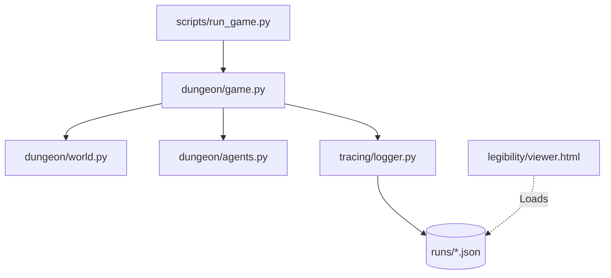

# 🏰 Dungeon Agents

[](https://www.python.org/)
[](https://openai.com/)
[](https://opensource.org/licenses/MIT)
[](https://docs.pytest.org/)

A structured multi-agent dungeon simulation built with a focus on **observability and legibility**. Two agents explore a fog-of-war environment while every turn, belief state, and tool interaction is captured in a diagnostic trace format.

---

## 📸 Overview

This project simulates two `gpt-4o-mini` agents navigating an `8x8` solvable dungeon. The core deliverable is not just the simulation, but the **legibility pipeline**: a system that turns LLM "black box" behavior into inspectable, replayable data.

### Key Highlights
*   **Deterministic World:** Authoritative server-side state with strict fog-of-war.
*   **Structured Tracing:** Every turn records tool input/output, belief state, and ground truth.
*   **Failure Diagnosis:** Divergence highlighting for failed tool outcomes (e.g., trying to unlock a door without a key).
*   **Delayed Messaging:** Agents communicate with a 1-turn delivery lag to simulate coordination challenges.

---

## 🛠️ Tech Stack

| Category | Technology |
| :--- | :--- |
| **Language** | Python 3.11+ |
| **LLM** | OpenAI Chat Completions (`gpt-4o-mini`) |
| **Agent Interface** | OpenAI Function Calling (Tools) |
| **Tracing** | Pydantic Schema + Local JSON + Langfuse (Optional) |
| **Visualizer** | Vanilla HTML5 / CSS3 / JavaScript |

---

## 🏗️ Architecture



### System Components
- **`dungeon/world.py`**: The source of truth. Manages grid generation (BFS-validated), movement rules, and item state.
- **`dungeon/agents.py`**: The LLM interface. Handles system prompt injection and tool definitions.
- **`tracing/logger.py`**: Captures `AgentEvent` objects and persists them for the viewer.
- **`legibility/viewer.html`**: A zero-dependency browser tool for replaying simulation traces.

---

## 🚀 Getting Started

### 1. Installation
```bash
python3 -m venv .venv
source .venv/bin/activate
pip install -r requirements.txt
```

### 2. Environment Setup
```bash
cp .env.example .env
# Edit .env and add your OPENAI_API_KEY
```

### 3. Run a Simulation
Execute a batch of 5 reproducible games:
```bash
python scripts/run_game.py --runs 5 --seed 42
```

---

## 🔍 Diagnosis & Replay

The project includes a **Legibility Viewer** located at `legibility/viewer.html`.

1. Open `legibility/viewer.html` in any modern browser.
2. Drag and drop a trace file from the `runs/` directory.
3. Use the **Ground Truth vs. Belief** toggle to see what the agent *thought* vs. what was *actually* there.
4. Navigate turns with `Arrow Keys` to inspect LLM reasoning and tool outputs.

---

## 🧪 Testing

The world mechanics and solvability logic are backed by a comprehensive test suite:
```bash
pytest tests/ -v
```

---

## 📝 Trace Schema

Each event in a trace is a structured object containing:
- **Metadata**: Latency, tokens, and turn number.
- **Action**: The specific tool called and its arguments.
- **Result**: Success flag and the direct output from the world.
- **State**: A full snapshot of the world and the agent's current belief state.
- **Divergence**: Automatic flags for when an agent's intended action fails.
